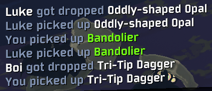

# ThatWasMine

Have you ever had your mate steal an item that you definatly got dropped from your kill with the Artifact of Sacrifice?

With ThatWasMine, you'll never have that problem again.

ThatWasMine prompts in the chat when an item drops with the Artifact of Sacrifice with who killed it and what dropped.

## Changelog

**1.0.1**

* Fixed naming mismatch inside of ThatWasMine.cs
* More descriptive README.

**1.0.0**

* Initial release of ThatWasMine
